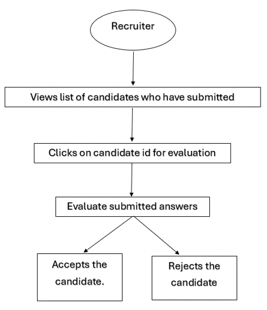

# Hushhush Recruiter

The backend service of a web application using Flask to assist companies in selecting potential candidates for recruitment.

## Problem Statement

Doodle is a famous software company that is in constant need of new developers, senior developers, and solution architects. Hence, it wishes to automate the recruitment process to get the best potential candidates from the market, while also keeping it “Secretive”.

## Implementation

### 1. Fetch data from sources like GitHub and StackExchange via APIs.

| Source | API | Path Parameters | Query Parameters | Rate Limit | Description |
| --- | --- | --- | --- | --- | --- |
| Github (users) | https://api.github.com/users/{} | id | - | 5000/hr | Get a user |
| Github (repo) | https://api.github.com/search/repositories | - | template, fork, created, per_page | 5000/hr | Search repositories |
| StackExchange | https://api.stackexchange.com/2.3/users/{} | id | page, pagesize, order, sort, site | 10000/hr | Get users |

### 2. Perform exploratory data analysis, followed by building a KNN clustering model to visualize data groupings.

#### Find value of K using elbow method

#### Feature pair plot

Reputation vs Repository Size

Reputation vs Followers

Followers vs Repository Size

### 3. Use the clustered data to train a logistic regression model.

#### Confusion Matrix

### 4. Stored all data in a PostgreSQL database.

### 5. Containerize the application using Docker Compose and deployed it with a microservices architecture.

- Execute the following inside the 'code' folder.
- Create a '.env' file with the following information:
    - POSTGRES_USER
    - POSTGRES_PASSWORD
    - POSTGRES_DB
    - POSTGRES_PORT
    - POSTGRES_HOST
    - PGADMIN_DEFAULT_EMAIL
    - PGADMIN_DEFAULT_PASSWORD
    - GITHUB_PAT
- Execute the command 'docker-compose up'

---

## User Stories

---

## Architecture

---