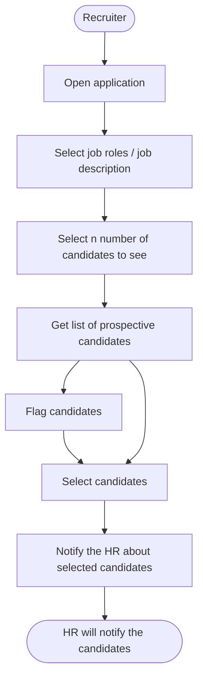
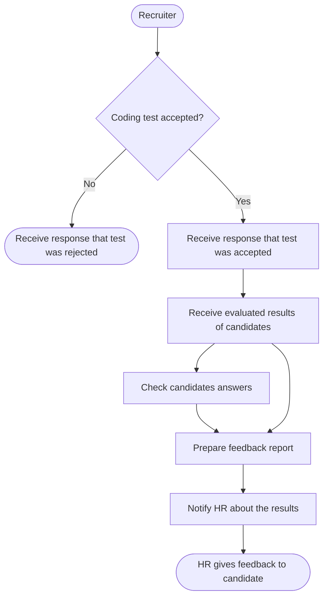
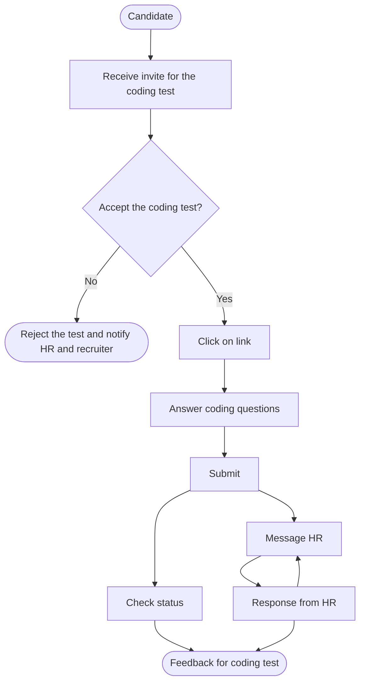
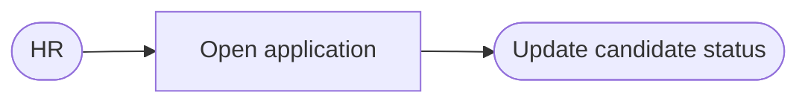
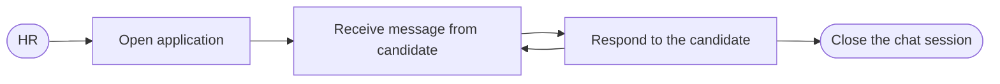

# 
Group 12 - User Stories

### Table of contents
1. [Recruiter User Story](#recruiter-user-story)
2. [Candidate User Story](#candidate-user-story)
3. [HR User Story](#hr-user-story)

---

### Recruiter User Story

As a recruiter of Doodle, 
- I wish to automate the process of candidate selection using an in-house solution for different job roles
- I would like to notify the prospective candidates about the job opportunity
- I would like to get the candidate's answers automatically evaluated (using existing neural networks, sonarqube, etc)
- I would like to give feedback to the candidate about the results along with a report.

### 
Candidate Selection

> Flagged candidates will not appear in the list in the future!

### 
Candidate Evaluation

---

### Candidate User Story

As a prospective candidate for the job at Doodle,
- I wish to get notified when I'm selected for the coding test
- I would like to submit my answers online
- I would like to receive a feedback for the coding test
- I would like to be able to contact the HR if I have any queries
- I would like to see the status of my coding test on the platform.

### 
Coding Test

---

### HR User Story

As a HR at Doodle,
- I wish to communicate with the candidate about being selected for the coding test
- I would like to provide feedback to the candidate about the coding test results
- I would like to be able to update the application status on the platform
- I would like to be able to communicate with the candidate if they have any queries.

### 
Status Update

> Status options: 1) Selected, 2) Rejected/Accepted, 3) Under Evaluation, 4) Fail/Pass

### 
Candidate Queries

---
---